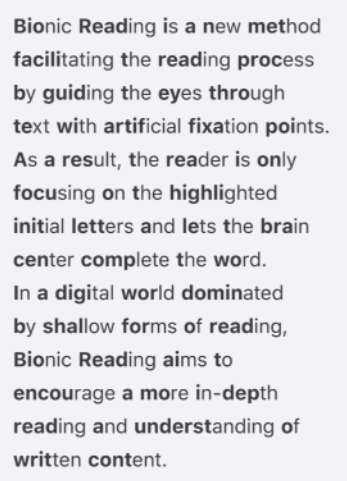
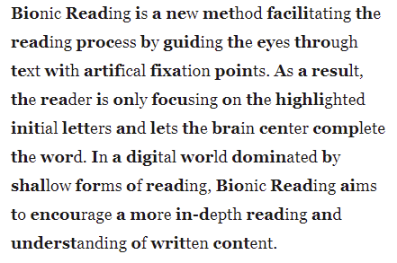
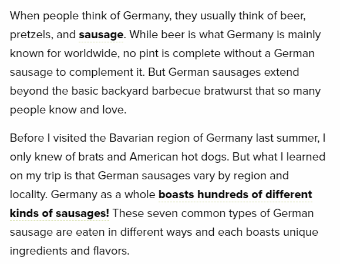
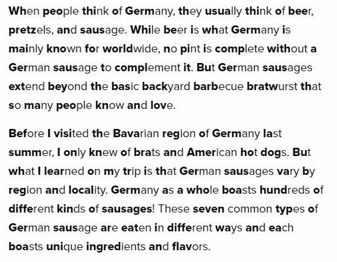

# Bionic Reading

## About this project

I recently found out about this thing called [Bionic Reading](https://bionic-reading.com/), which is honestly a pretty cool project. Now I dunno about y'all, but as someone who has ADHD it's difficult af to get through a block of text without reading the same sentence 15 times, and Bionic Reading helps A LOT with that.

Basically, it allows your brain to read and process text at a much faster rate, because you only have to visually process a portion of the word, and your brain just fills in the gaps.

However, there's a couple issues I have with the original project, morally.

The biggest flaw is the fact that (based on the limited research I've done, so please correct me if I'm wrong), it's currently incredibly inaccessible. They have it available as an API, which is cool because you can implement it into your own apps, but that leaves it only accessible to developers that have the time and ability to actually implement the API into their applications. Your average Joe just has to wait for it to be implemented on an application that they use, if it ever happens to begin with.

The second glaring issue is the fact that the company has patented and trademarked the algorithms for it. Sure, I get it, intellectual property and all that shit. But doing so ensures they can be the only ones (legally) to provide the project as a service.

Anyway, I've always thought copyright law is stupid as fuck, ESPECIALLY when it comes to products and services that have a positive/benificial use for a majority of people (basically: privatized medicine is awful and restrictive, but that's another gripe for another time).

So that brings me to this project! Bionic Reading? Yeah, I just did the same exact fucking thing BUT instead I plugged it into a Chrome extension so it's publicly accessible.

And before I get slapped with a cease and desist order: I didn't use any fancy algorithms, so their precious trademarked IP isn't being infringed upon (read as: eat my ass). Literally all this project does is add a bold styling to the first half of every word, and by doing so it achieves the same effect.

For comparison: the sans-serif font is the official project, and the serif font is my personal rendition of it. It's pretty close, but very basic. Again, there are no infringed algorithms here. 🙄

## The Actual Bionic Reading

## My Bootlegged Bionic Reading

These next screenshots showcase my version of Bionic Reading at work, with a default block of text as a comparison. It's not perfect by any means - because it's NOT an algorithm - but as you can see, it achieves the same effect.

## Before

## After

Anyway, the extension is still a work in progress and isn't yet finished by a long shot. However, it's publicly available and is open source, and I'm happily accepting contributions to help bring it to completion and beyond!

Fuck inaccessibility.
